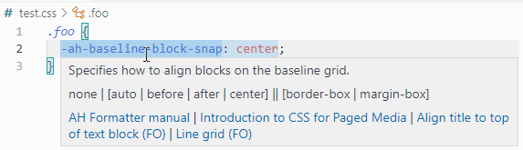

# AH Formatter CSS Extension Properties

VS Code extension that provides auto-completion and hover information in CSS files for [AH Formatter](https://www.antennahouse.com/formatter-v7) extension [CSS properties](https://www.antenna.co.jp/AHF/help/en/ahf-focss6.html).

The extension can be enabled globally or for individual workspaces.

This extension uses [vscode-custom-data](https://github.com/microsoft/vscode-custom-data) format and the [`contributes.css.customData` Contribution Point](https://code.visualstudio.com/api/extension-guides/custom-data-extension).

**ahformatter-vscode-css-en** version numbers correspond to the AH Formatter version current at the time of the release.

## Install

You can install the extension in the following ways:

<!-- - Search for `AH Formatter CSS Extension Properties` in the extension panel and install it
- Download from [Marketplace](https://marketplace.visualstudio.com/items?itemName=antennahouse.ahformatter-vscode-css-en)-->
- Download from [GitHub Release](https://github.com/AntennaHouse/ahformatter-vscode-css-en/releases) page

## Demo

## Reference material

The hover information can include four types of links to reference material:

- **AH Formatter manual** - Link to property definition in the AH Formatter manual
- **XSL 1.1** - Link to the definition of an XSL 1.1 property. Only present for a mirror of an unextended XSL-FO property.
- **Introduction to CSS for Paged Media** - Link to property information in [Introduction to CSS for Paged Media](https://www.antennahouse.com/css) book
- ***Title* (FO)** - Link to PDF sample that shows the property in use. The PDF is formatted from XSL-FO source, but the property's usage is the same.

## License

[MIT](LICENSE)
